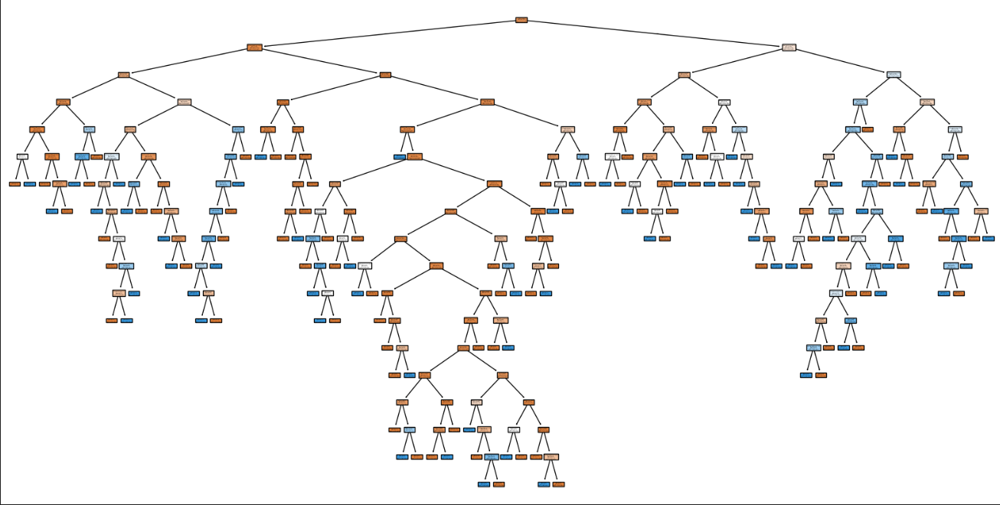

# Wine Quality Classification Using Decision Trees

## Overview

This project uses a **Decision Tree classification model** to predict wine quality based on physicochemical properties of red wine. The goal is to classify wines into **low quality** or **high quality** categories using measurable features such as acidity, density, and alcohol content.

The analysis demonstrates a complete machine learning workflow including **data preprocessing, model training, evaluation, and visualization**.

The dataset comes from the **UCI Machine Learning Repository Wine Quality dataset**.

---

## Dataset

Each observation in the dataset represents a red wine sample with laboratory measurements describing its chemical composition.

Original dataset source:  
https://archive.ics.uci.edu/ml/datasets/Wine+Quality

### Input Features

The following variables were used as predictors:
- **fixed_acidity**
- **volatile_acidity**
- **residual_sugar**
- **density**
- **pH**
- **alcohol**

### Target Variable
The original wine quality score ranges from **0–10**.  
For classification purposes, the values were converted into two categories:

- **0 – Low Quality** (original scores 3–6)
- **1 – High Quality** (original scores 7–10)

This converts the problem into a **binary classification task**.

---

## Project Workflow

### 1. Data Preprocessing

The dataset was prepared using the following steps:

- Loaded the dataset using **Pandas**
- Converted quality scores into binary classes
- Selected relevant features for model input
- Split the dataset into **training and testing sets**
- Standardized features using **StandardScaler**

---

### 2. Model Training

A **Decision Tree Classifier** from `scikit-learn` was used to train the model.

The model was trained using the training dataset and then applied to the test dataset to generate predictions.

---

### 3. Model Evaluation

Model performance was evaluated using standard classification metrics:

- **Accuracy Score**
- **Confusion Matrix**
- **Classification Report**

These metrics help measure how well the model distinguishes between low and high quality wines.

---

### 4. Model Complexity Analysis

To prevent overfitting, multiple models were trained using different **max_depth** values for the decision tree.

Testing different depths helps determine a balance between:

- model accuracy
- model complexity
- generalization to new data

---

## Decision Tree Visualization

The trained decision tree was visualized using `plot_tree` from scikit-learn.

This visualization shows:

- how the dataset is split at each node
- which features influence predictions
- the decision paths used to classify wines

---

## Technologies Used

- **Python**
- **NumPy**
- **Pandas**
- **Scikit-learn**
- **Matplotlib**

---
## Key Concepts Demonstrated

This project demonstrates several core machine learning concepts:

- data preprocessing
- feature selection
- decision tree classification
- model evaluation
- model visualization
- controlling model complexity

These techniques are commonly used in **data science and predictive modeling workflows**.
